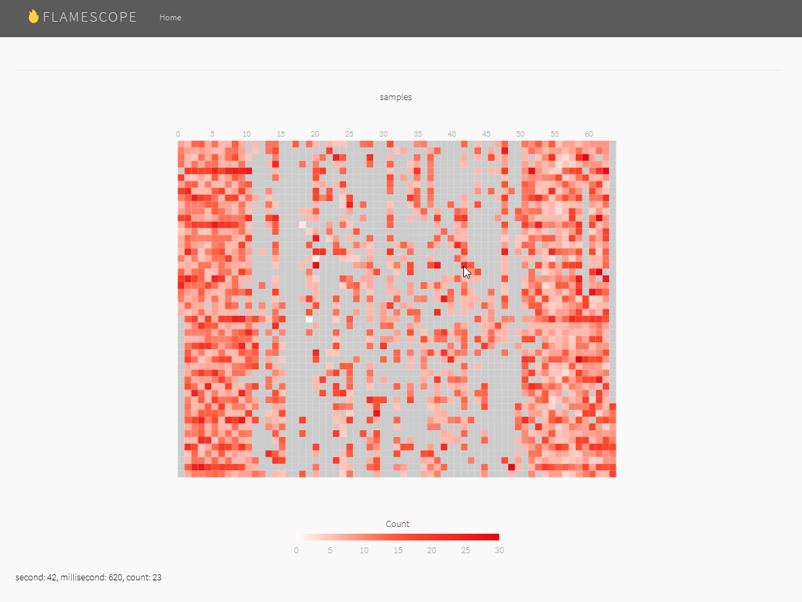
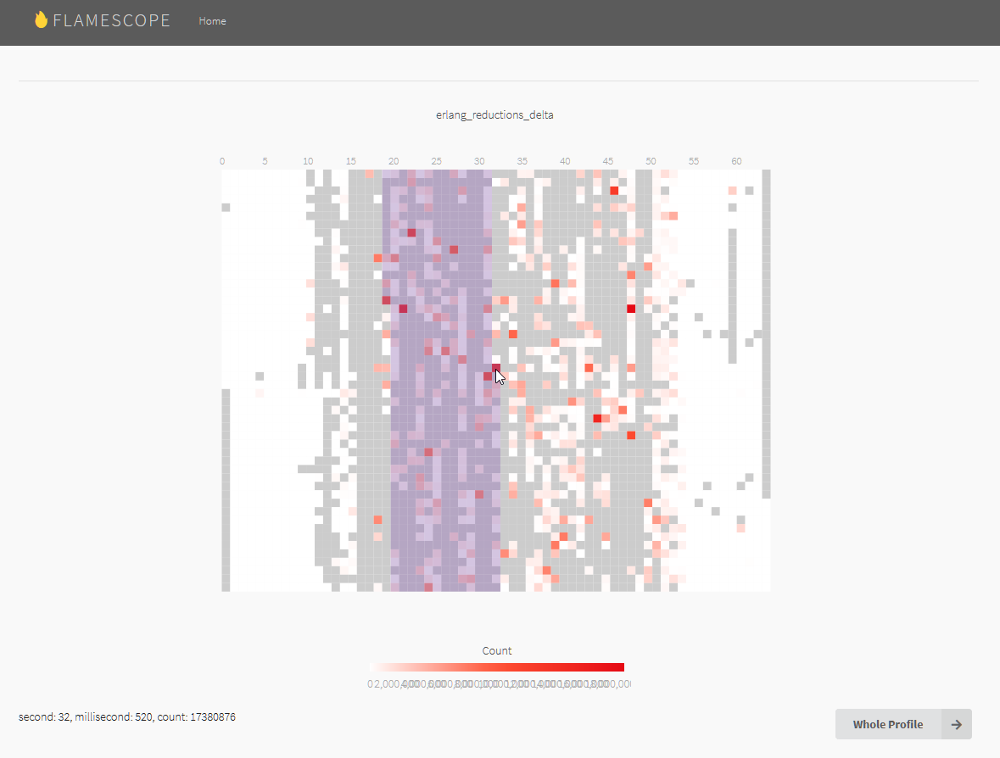
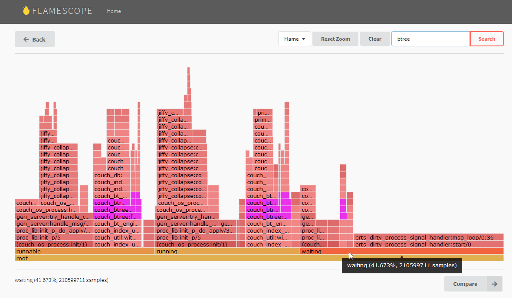
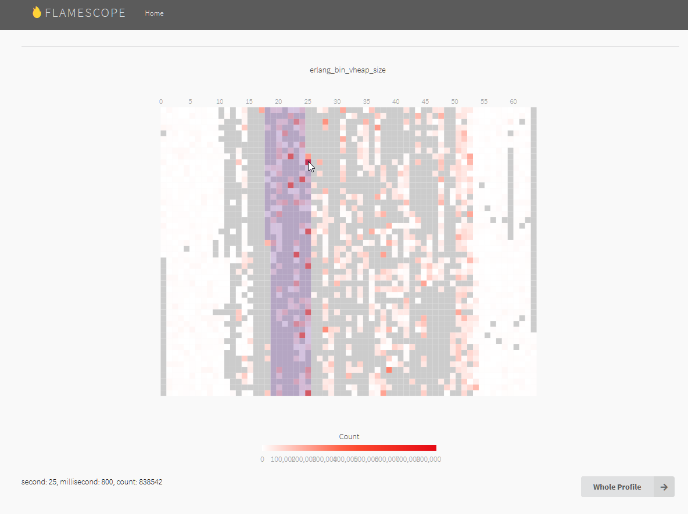
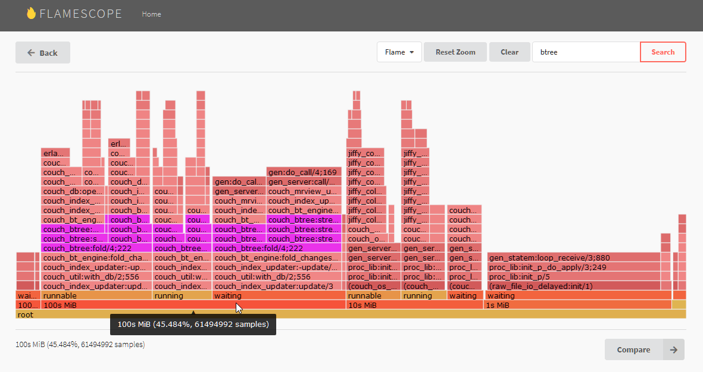
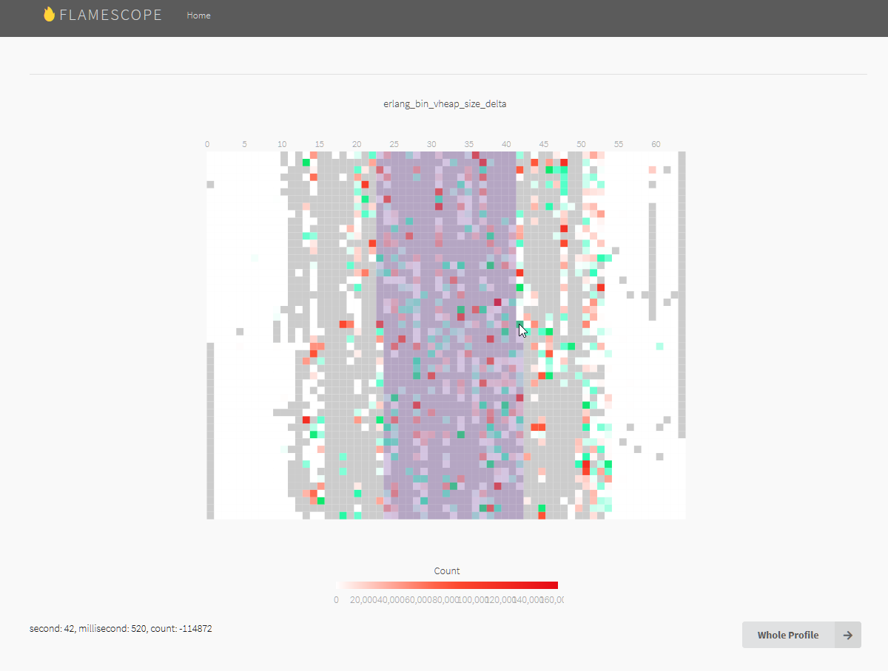
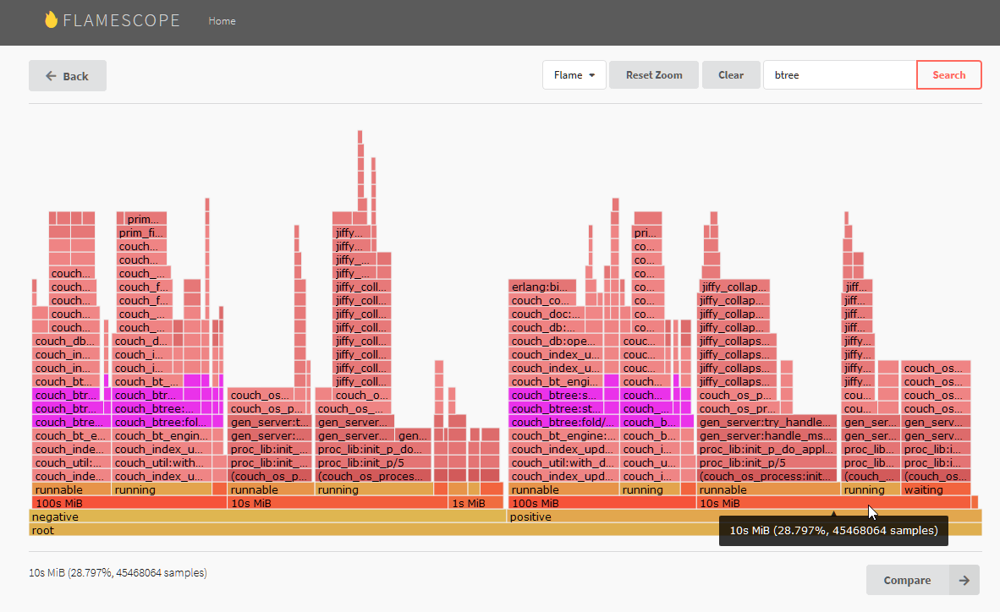

# **flame_prof**

<h3><em>NOTE: This project is under active development. Reference documentation,
tutorials and a number features are in the works.</em></h3>

## Contents

  - [Overview](#Overview)
  - [Screenshots](#Screenshots)
    - [Example](#Example)
    - [Samples](#Samples)
    - [High scheduler load](#High-scheduler-load)
    - [Off-heap binaries](#Off-heap-binaries)
  - [There's much more](#Theres-much-more)
  - [Build](#Build)

## Overview
 
**flame_prof** is a general-purpose Erlang profiler a little like OTP's
**fprof**,  except ...

+ It generates Linux [perf_events](https://en.wikipedia.org/wiki/Perf_(Linux))
script [output](https://linux.die.net/man/1/perf-script) (even on Win/macOS) 
intended to be consumed by, and analysed with, [a fork of Netflix's Flamescope](https://github.com/ebegumisa/flamescope).

+ It uses a call-stack sampling approach rather than attempting to measure each
individual call. So it does not _need_ to use Erlang tracing (though it _may_ 
use tracing for certain optional features).

+ It retains calling process information including process status, memory usage,
message queue lengths and garbage collection info.

+ Provides control over output file writing (e.g. sample flush frequency, output
file rotation).

+ It provides means to automatically select processes to be profiled
(e.g. top 100 by reductions). Automatically triggering profiling in controlled
manner is coming soon.

## Screenshots

### Example

Below are a few (of many) sub-second heatmaps and Erlang code flamegraphs
generated from a node being profiled once for a little over a minute. The
profiler was configured to, every 5 seconds, auto-select and profile the top 100
processes.

### Samples

Colour saturation in the heatmap below is scaled to the number of callstack
samples taken by the profiler. Grey areas show where the node was so busy, the
profiler was unable to take regular samples (long lines of grey are a special
case -- these are due to the profiler flushing samples to disk every 15
seconds.)

Despite the load, there are still plenty of samples in the middle busy part to
be able to gain insights from the other heatmaps and flamegraphs in the sections
that follow. Moreover because the other heatmaps and flamegraphs integrate
metrics mesurements like reductions differences, even large gaps between samples
still gives us usable data.

### High scheduler load

The reductions heatmap and corresponding flamegraph below show what callstacks 
contributed most to schedular load in the example profile. Colour saturation in
the heatmap and widths in the flamegraph are scaled to reductions. _Scaling
flamegraph widths by metrics measured during sampling_ is the first of
**flame_prof's two main innovations**.

Crucially, in the flamegraph, the callstacks are categorised by the _process 
status_ of upto 100 processes running that particular code (the example profile 
auto-selected the top 100.) Such _callstack categorisation/grouping_ is
**flame_prof's other main innovation**. It has proven extremely useful
especially in identifying code causing concurrency bottlenecks or memory issues.

### Off-heap binaries

In addition to CPU load, **flame_prof** can also be used to identify code
causing memory and/or garbage collection problems.

Take binaries for instance. The bin_vheap_size heatmaps and corresponding 
flamegraphs below show size of off-heap binaries referenced by the callstacks.
Colour saturation in the heatmap and widths in the flamegraph are scaled to
words.

Using some more callstack categorisation, the flamegraph is able to further
group callstacks by the memory used by those processes when the calls were being
made.

Below, we again see bin_vheap_size heatmaps and flamegraphs but this time by the
delta. Green hue in the heatmap shows releases with saturation scaled to words.
The flamegraph is further still categorised by positive (references) and
negative (releases), the width of both scaled to words.

## There's much more

In addition to above, **flame_prof** generates heatmaps and flamegraphs for 
process message queue lengths, message buffer sizes, stack memory, heap memory
and garbage collection (heap block sizes, etc) allowing the developer to easily 
and meaningfully cross reference these metrics with thousands of callstacks 
sampled from thousands of processes over a timeline.

## Build

    $ rebar3 compile